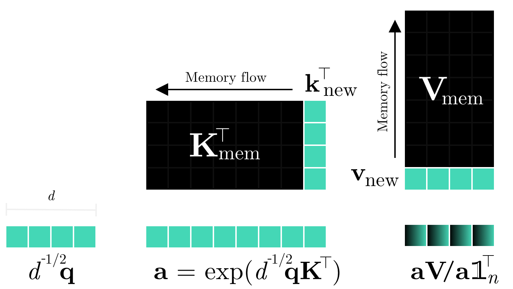
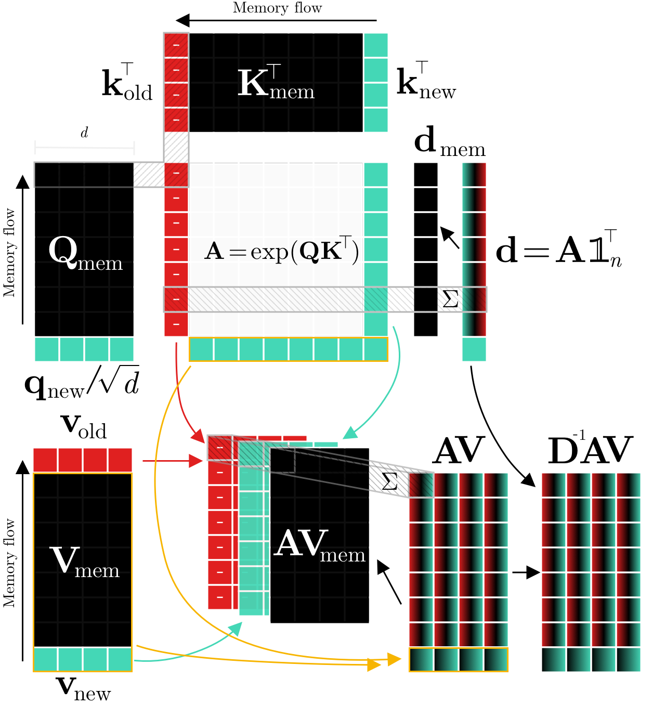

# Continual Transformers TensorFlow
<div align="left">
  <!-- <a href="https://pypi.org/project/continual-transformers-tf/">
    
  </a> -->
  <a href="http://arxiv.org/abs/2201.06268">
    
  </a>
  <!-- <a href="https://badge.fury.io/py/continual-transformers-tf">
    
  </a> -->
  <!-- <a href="https://pepy.tech/project/continual-transformers-tf">
    
  </a> -->
  <a href="https://codecov.io/gh/LukasHedegaard/continual-transformers-tf">
    
  </a>
  <a href="https://opensource.org/licenses/Apache-2.0">
    
  </a>
  <a href="https://github.com/psf/black">
    
  </a>
</div>

TensorFlow implementation of Continual Transformer building blocks, which augment regular transformer layers with the ability to update the attention output _per token step_.

The layers are modelled on the `tf.keras.layers.MultiHeadAttention` and should work as drop-in replacements in most cases.

## Setup
Continual Transformers and its modules can be installed in in your project using:
```setup
pip install git+https://github.com/LukasHedegaard/continual-transformers-tf.git
```

## Layers
### Continual Single-output Multi Head Attention
```python
from continual_transformers_tf import CoSiMultiHeadAttention

net = CoSiMultiHeadAttention(seq_len=10, num_heads=2, key_dim=4)
```
See [tests](tests/test_co_si_mha.py) for usage examples .

<div align="center">
  
  <br>
  <div align="left">
  Fig. 1: Continual Single-Output Dot-Product Attention. 
        The key (K) and value (V) matrices are aggregated over time by caching the step vectors k_n and v_n in a FIFO queue. During each step, only the attention output associated with q is computed.
  </div>
  <br>
</div>


<!-- <div align="center">
  
  <br>
  <div align="left">
  Fig. 2: Continual Retroactive Dot-Product Attention. 
  The query (Q), key (K), and value (V) matrices are aggregated over time by caching the step vectors q_n, k_n, and v_n in a FIFO queue. During each step, only the entries of A associated with q_n, k_n, and the oldest K step, k_o are computed. 
  The diagonal entries of the row-normalisation matrix D as well as the AV can be updated retroactively by subtracting features corresponding to k_o and adding features related to k_n to the cached outputs of the previous step, D_{mem} and AV_{mem}, respectively.
  </div>
  <br>
</div> -->